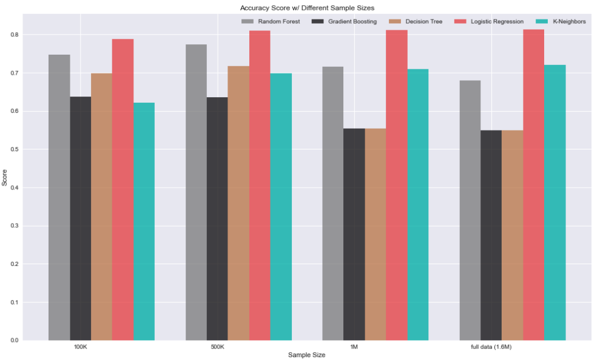

# Tweet Sentiment Classification

Since my last project was one where I practiced linear regression, I wanted to try something different this time. I decided to use and tune classification models to classify tweets into categories: positive or negative. I ran five classification models with SKLearn as well as an LSTM recurrent neural network.

## Data Descripton

I worked with a [dataset called 'Sentiment140'](http://help.sentiment140.com/for-students/) that comprised of 1.6 million tweets from the late spring, early summer of 2009, as well as their time stamp, user, tweet ID, and most importantly, their polarity. Polatiry was listed as a 0 if a tweet was negative, 2 if a tweet was neutral, and 4 if it was positive. 

My testing data (data was pre-split into train and test) also came with a column called 'Query' which worked as a categorizer. For example, tweets with a query of 'obama' were about President Barack Obama, those with a query of "at&t" were about the company.

Because I had 'query' as well as polarity, I  wanted to see which topics were the most liked and most disliked. Because I had the dates of each tweet, I tried made in inference on why a certain topic was percieived a certain way.

### Topics with highest mean polarity
Topic | Date | Why
----- | ---- | ----
kindle2 |  may 11 - jun 10 2009 | came out few months ago
obama | 	may 10 2009 |	WHCD funny speech
lebron| may 11 2009 | 	47 points in playoff game
danny_gokey | may 13 2009 |	appearance on American Idol

*Obama was new, Lebron was popular, and Idol was huge. Good times.*

### Topics with lowest mean polarity
Topic | Date | Why
----- | ---- | ----
iran |  june 14 2009 | 2009 election protests
gm | 	june 1 2009 |	files bankrupcy
at&t| june 8 2009 | 	wide spread bad service, tons of complains
aig | may 10 - may 18 2009 |	paid themselves huge bonuses

*Both the country and the world were on the brink of the Great Recession*

## Class Imbalance

One issue I had to briefly handle was class imbalance. My data was very clean, but I had a very equal number of positive and negative tweets (800K each) and a very small number of neutral tweets (less than 150). Since over or under sampling was not an option, I had to remove the tweets classified as neutral and just work with positives and negatives.

## Vectorizing Tweets

I used [TFIDF Vectorizer, a scikit-learn method](https://scikit-learn.org/stable/modules/generated/sklearn.feature_extraction.text.TfidfVectorizer.html) that cleans text and turns it into numerical vectors, which can then be compared and classified using machine learning models.

## Classificaition Models

I ran five classification models on the tweet vectors. Below is a graph that shows their performance when used with their default paremeters. 

I wanted to tune my hyperparameters with GridSearchCV and I used an [AWS EC2 C5 Instance](https://aws.amazon.com/ec2/instance-types/c5/) to get more computational power. Once I got optimal hyperparemeters for all five models, I ran them on different sample sizes of data to see how each would fare. Below are the results.

## LSTM Neural Network

I wanted to explore the idea of an LSTM Neural Network so I trained by tweer data on that. After spending lots of time manipulating/adding/removing layers and epochs I came up with a model whose accuracy was on par with my scikit-learn models and also had a decreasing loss per epoch. Below are the layers I ended up using, and below that is a graph of accuracy and loss. 

  * Sequential Model
  * Embedding Layer
  * Dropout Layer
  * Embedding Layer
  * **Two** LSTM Layers
  * Dense Layer, Sigmoid Activiation Function

  * 10 Epochs - ran 6 due to EarlyStop()
  * 64 Batch Size

  * Loss function: Binary Crossentropy
  
  
  
  
  
# Conclusion

My Logitic Regression and LSTM Neural Network models finished with the best scores. 

# Next Steps

* Dive deeper into my LSTM Neural Network, add more layers, both in an effort to get a higher score and learn more about the model!

* Do classification projects on multiple classes.

* Classify tweets by category, instead of by sentiment.

